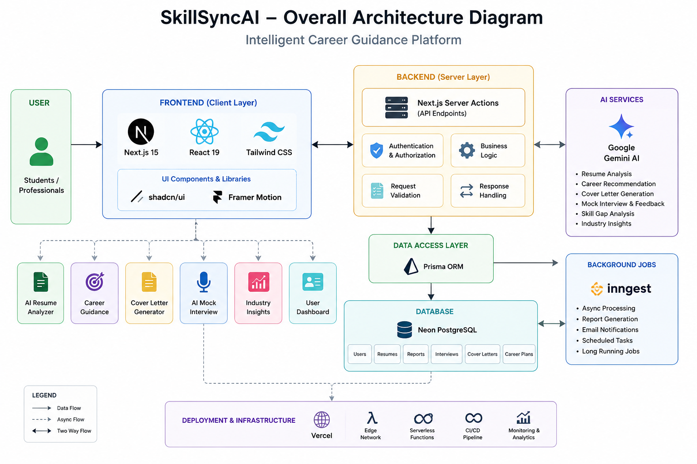

<div align="center">

# 🚀 SkillSyncAI – Intelligent Career Guidance Platform

### AI-Powered Career Development Platform for Students & Professionals

<p align="center">
SkillSyncAI leverages Artificial Intelligence to help users build ATS-friendly resumes, generate professional cover letters, prepare for interviews, identify skill gaps, and receive personalized career guidance—all in one modern web application.
</p>

<p align="center">


</p>

</div>

---

# 📖 Overview

**SkillSyncAI** is a full-stack AI-powered career guidance platform designed to empower students, fresh graduates, and professionals with intelligent career planning tools.

Using **Google Gemini AI**, the platform provides personalized career recommendations, ATS resume analysis, AI-generated cover letters, mock interview preparation, skill gap analysis, and real-time industry insights.

The application is built with a modern, scalable architecture using **Next.js 15**, **React 19**, **Prisma ORM**, **Neon PostgreSQL**, **Clerk Authentication**, **Inngest**, **Tailwind CSS**, and **Shadcn UI**.

---

# ✨ Features

## 🤖 AI Resume Analyzer & Builder

Optimize your resume with AI-powered insights and improve your chances of passing Applicant Tracking Systems (ATS).

- 📊 ATS Resume Score Analysis
- 📝 AI-Powered Resume Improvement Suggestions
- 📄 Intelligent Resume Parsing
- 🎯 Skill Extraction & Classification
- 💼 Experience & Project Analysis
- 🔍 Missing Keyword Detection
- 📈 Resume Strength & Weakness Report
- ⚡ ATS Keyword Optimization
- 🧠 Personalized Career Recommendations
- 📥 Resume History & Version Management

---

## 🎯 AI Career Guidance

Receive personalized career advice based on your skills, education, interests, and current industry trends.

- 🎯 Personalized Career Recommendations
- 🛣️ AI-Generated Career Roadmap
- 📊 Skill Gap Analysis
- 📚 Personalized Learning Path Suggestions
- 🚀 Career Growth Tracking
- 💡 Recommended Certifications
- 📈 Industry Trend Analysis
- 💼 Job Role Matching
- 🌍 Emerging Technology Insights
- 🎓 Career Readiness Assessment

---

## 📄 AI Cover Letter Generator

Generate professional, job-specific cover letters in seconds using Generative AI.

- ✍️ Personalized AI Cover Letters
- 💼 Job Description-Based Generation
- 🎯 Company-Specific Customization
- 📄 Professional Formatting
- ⚡ One-Click Generation
- 📝 Multiple Cover Letter Templates
- 🔄 Regenerate & Improve Content
- 📥 Easy Copy & Download
- 🌍 ATS-Friendly Writing Style

---

## 🎤 AI Mock Interview

Practice realistic interviews with AI and receive detailed feedback to improve your confidence.

- 🤖 AI-Generated HR Interview Questions
- 💻 Technical Interview Practice
- 🧠 Behavioral Interview Simulation
- 🎯 Role-Specific Interview Questions
- 📊 AI Performance Evaluation
- 📝 Instant Feedback & Suggestions
- ⭐ Overall Performance Score
- 📈 Strength & Weakness Analysis
- 🎤 Confidence Improvement Tips
- 📚 Interview History & Progress Tracking
---

# 📸 Screenshots

| Home Page | Dashboard |
|-----------|-----------|
| ) | ) |

| AI Resume Analyzer | AI Mock Interview |
|--------------------|-------------------|
| ) | ) |

| AI Cover Letter | Industry Insights |
|-----------------|-------------------|
| ) | ) |

---

## 📊 Technology Summary

| Category | Technologies |
|----------|--------------|
| **Frontend** | Next.js 15, React 19, Tailwind CSS, Shadcn UI, Framer Motion |
| **Backend** | Next.js Server Actions, Prisma ORM, REST APIs |
| **Database** | Neon PostgreSQL |
| **Authentication** | Clerk |
| **Artificial Intelligence** | Google Gemini AI |
| **Background Jobs** | Inngest |
| **Deployment** | Vercel |
| **Version Control** | Git & GitHub |
---


# 🏗 Architecture



---

# 🚀 Key Modules

- Authentication
- AI Resume Analyzer
- Resume Builder
- Cover Letter Generator
- Career Recommendation Engine
- AI Mock Interview
- Industry Insights
- User Dashboard

---

# 📂 Project Structure

```bash
SkillSyncAI/
│
├── app/
├── actions/
├── components/
├── hooks/
├── lib/
├── prisma/
├── public/
├── data/
├── middleware.js
├── package.json
└── README.md
```

---

# 📚 Tech Keywords

Artificial Intelligence • Google Gemini AI • Next.js • React • JavaScript • Tailwind CSS • Prisma ORM • PostgreSQL • Neon Database • Clerk Authentication • Inngest • Resume Builder • ATS Resume • AI Career Coach • Mock Interview • Cover Letter Generator • Career Guidance • Full Stack Development • Web Development • Generative AI

---

# 👨‍💻 Author

## Ashwin Chauhan

**Computer Science Engineering Student | Full Stack Developer | AI Enthusiast | Open Source Contributor**


---

# 📄 License

This project is licensed under the **MIT License**.

---

<div align="center">


Made with ❤️ by **Ashwin Chauhan**

</div>